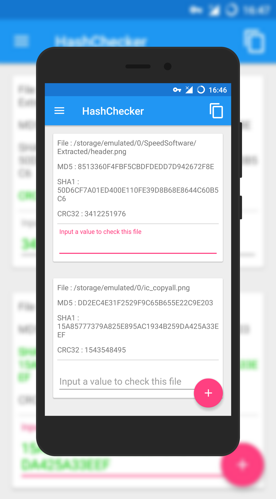
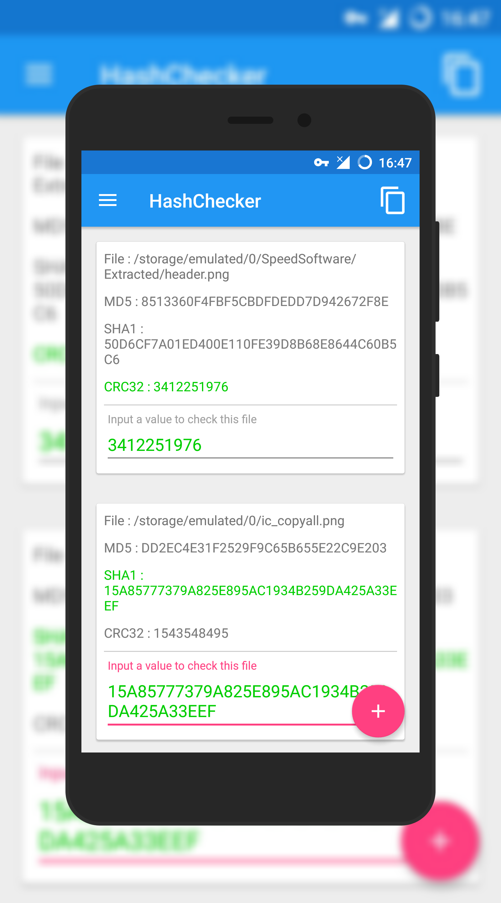

# HashChecker
A simple hash calculator  
一个简单的 Hash 计算应用  
  
Feel free to do anything you like, for example, fork it and change it.  
随便对待它吧，你可以Fork并自行修改 。 

Now, you are able to check a file in other apps.(After 1.4)  
现在，你可以在其它应用中检查文件正确性。（1.4之后）

## HOW TO USE HASHCHECKER'S API IN OTHER APPS - FAST TUTORIAL
**Step 0**  
You should have a file and a value to compare with.  
你需要有一个文件和一个用于比对的值。  
Of course, an Android device with this app.  
当然还有，一台装有 HashChecker 的 Android 设备。
  
**Step 1**  
Create an Intent and turn action in it.  
实例化一个 Intent 并向内放入 action 。  
For example,  
比如：
```
…
Intent intent = new Intent();
intent.setAction("net.rachel030219.hashchecker.action.CALCULATE_MD5");
…
```
Optional action list is rolled out.  
可选的 action 列表已放出。

**Step 2**  
Turn in extra and set type.  
放入数据，设置类型。
```
…
intent.putExtra("net.rachel030219.hashchecker.extra.URI",uri);
intent.putExtra("net.rachel030219.hashchecker.extra.VALUE",value);
intent.setType("image/png");
…
```
For more information, please look up API DOC below.  
欲获得更多信息，请查阅下面的 API 文档。

**Step 3**  
Just send it out!  
~~射~~发出来吧！
```
…
try {
    startActivityForResult(intent,REQUEST_CODE);
} catch (android.content.ActivityNotFoundException e) {
    // This means the user has not installed HashChecker
}
…
@Override
protected void onActivityResult(int requestCode,int resultCode,Intent data){
    if (requestCode == REQUEST_CODE){
        switch(resultCode) {
            case 100:
                // Do something…
                break;
            case -100:
                // Do something…
                break;
            default:
                // Must be something happened. I suggest to ignore this section in your code.
                break;
        }
    }
}
```

**And…**  
That's all! So easy, right?  
没了！很简单，不是吗？

> 若有需要，请参阅 [APIExample](https://github.com/Rachel030219/HashChecker/blob/master/apiexample)

## API DOC

#### Actions
0. `net.rachel030219.hashchecker.action.CALCULATE_MD5`  
    Calculate and compare file's MD5  
    计算、比较 MD5 值
    
1. `net.rachel030219.hashchecker.action.CALCULATE_SHA1`  
    The same, SHA1  
    同理， SHA1
    
2. `net.rachel030219.hashchecker.action.CALCULATE_SHA256`  
    Again, SHA256  
    同理x2， SHA256
    
3. `net.rachel030219.hashchecker.action.CALCULATE_SHA384`  
    Againn, SHA384  
    同理x3， SHA256
    
4. `net.rachel030219.hashchecker.action.CALCULATE_SHA512`  
    Againnn, SHA384  
    同理x4， SHA256
    
5. `net.rachel030219.hashchecker.action.CALCULATE_CRC32_HEX`  
    Againnnn, CRC32, remember to turn in a hexadecimal value  
    同理x5， CRC32 ，记得传入一个十六进制值
    
6. `net.rachel030219.hashchecker.action.CALCULATE_CRC32_DEC`  
    Againnnnn, CRC32, you need also to turn in a String value, although decimal CRC32 can be long value  
    同理x6， CRC32 ，你同样需要传入一个 String 值，即使十进制的 CRC32 可以用 long 存储
    
#### Extras
0. `net.rachel030219.hashchecker.extra.URI` - `android.net.Uri`  
    File's uri path, which tells where the file is.  
    文件的 Uri 路径。  
    You can turn in this extra or below one. Its priority is higher than below.  
    你可以传入这个 extra 或者下面那个。这个 extra 的优先级比下面那个更高。

1. `net.rachel030219.hashchecker.extra.FILE` - `java.io.File`  
    File, just the one you want to do with.  
    文件，就是你想动的那个。  
    You can turn in this extra or above one. Its priority is lower than above.  
    你可以传入这个 extra 或者上面那个。这个 extra 的优先级比上面那个更低。
    
    > Description of the priority  
      关于优先级的解释  
      For example, you turn in both file and uri at the same time ~~(what a silly decision)~~ , and they toward to different files. Then, HashChecker will only use the file what the uri towards to.   
      例如，你同时放入 File 和 Uri ~~（是不是傻）~~，而且它们还指向不同的文件。这时， HashChecker 将默认使用 Uri 所指向的文件。
    
2. `net.rachel030219.hashchecker.extra.VALUE` - `java.lang.String`  
    The value which will be compared with the result.  
    最后会和结果进行对比的值。  
    Android limits the result an activity can return, so you **MUST** turn in this.  
    Android 限制了 activity 能够回传的结果，所以你**必须**传入这个值。  
    BTW, HashChecker will auto change its case, so do not change it specially.  
    另外， HashChecker 会自动改变其大小写，不必特意去改动。
    
#### And the result…
As what I said, HashChecker is unable to return a String value, so its API is used for only comparing.  
就像我所说的那样， HashChecker 不能回传 String 值，所以它的 API 只用来比较。  
And so, you need to check what it returns. Only two cases.  
那么，你就需要检查它所返回的值。只有两种情况。

0. `100` - `java.lang.Integer`  
    In this case, result matches what you have turned in. Congratulations!  
    这种情况下，结果与你所传入的值匹配。恭喜！  
1. `-100` - `java.lang.Integer`  
    In this case, result does not match what you have turned in. Maybe you need to check the file.  
    这种情况下，结果与你所传入的值不相符。可能得查查这个文件了。  
2. And other values?  
    Umm… I don't know either. Maybe your user did something that impolite to HashChecker. So if you got this case, you can just retry. ~~(F***ing your user is also OK)~~  
    唔…我也不知道了。可能你的用户做了某些对 HashChecker 不礼貌的事情。所以如果你发现出现这种奇葩事情，重来就行。 ~~（对你的用户表示*礼貌*也行我不反对）~~  

***

欢迎关注 [Telegram Channel](https://telegram.me/rachelnotice) / [Twitter](https://twitter.com/tangrui003)




***
### LICENSE
```
   Copyright 2017 Rachel030219

   Licensed under the Apache License, Version 2.0 (the "License");
   you may not use this file except in compliance with the License.
   You may obtain a copy of the License at

       http://www.apache.org/licenses/LICENSE-2.0

   Unless required by applicable law or agreed to in writing, software
   distributed under the License is distributed on an "AS IS" BASIS,
   WITHOUT WARRANTIES OR CONDITIONS OF ANY KIND, either express or implied.
   See the License for the specific language governing permissions and
   limitations under the License.
```
