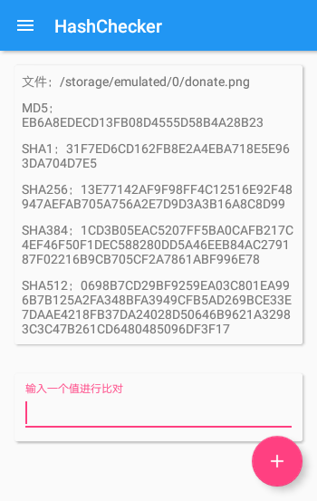

# HashChecker
A simple hash calculator  
一个简单的 Hash 计算应用  
  
Feel free to do anything you like, for example, fork it and change it.  
随便对待它吧，你可以Fork并自行修改  

（懒所以照搬了OAO
  
欢迎关注 [Telegram Channel](https://telegram.me/rachelnotice) / [Twitter](https://twitter.com/tangrui003)



***
### LICENSE
```
   Copyright 2016 Rachel030219

   Licensed under the Apache License, Version 2.0 (the "License");
   you may not use this file except in compliance with the License.
   You may obtain a copy of the License at

       http://www.apache.org/licenses/LICENSE-2.0

   Unless required by applicable law or agreed to in writing, software
   distributed under the License is distributed on an "AS IS" BASIS,
   WITHOUT WARRANTIES OR CONDITIONS OF ANY KIND, either express or implied.
   See the License for the specific language governing permissions and
   limitations under the License.
```
